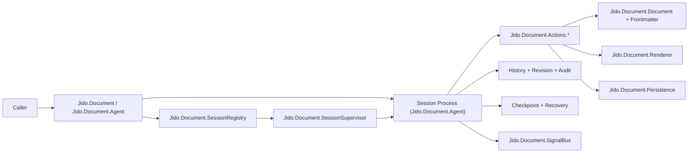

# 01 - Architecture Overview

`jido_document` is a session-oriented document runtime focused on:

- in-memory document state management
- file-backed persistence with divergence detection
- render preview generation
- operational safety, history, and recovery

This library is intentionally non-UI. Transport and presentation are external
integration concerns.

## Core architectural boundaries

- Stable API boundary:
  - `Jido.Document`
  - `Jido.Document.Agent`
  - `Jido.Document.Document`
  - `Jido.Document.Frontmatter`
  - `Jido.Document.Renderer`
  - `Jido.Document.SchemaMigration`
  - `Jido.Document.SessionRegistry`
  - `Jido.Document.Signal`
  - `Jido.Document.SignalBus`
- Internal implementation boundary:
  - `Jido.Document.Actions.*`
  - `Jido.Document.Persistence`
  - `Jido.Document.History`
  - `Jido.Document.Checkpoint`
  - `Jido.Document.Revision`
  - `Jido.Document.Authorization`
  - `Jido.Document.Audit`
  - `Jido.Document.Reliability`
  - `Jido.Document.Safety`
  - `Jido.Document.PathPolicy`

## High-level component map

## Canonical flow

1. Caller resolves/starts a session.
2. Caller sends action commands through `Agent.command/4`.
3. Agent executes one action module with a normalized context.
4. Agent updates session state, history, revision, and audit metadata.
5. Agent emits session-scoped signals for subscribers.
6. Save operations persist using atomic-write and divergence checks.

## Architectural invariants

- Document state is session-owned and process-local (`Agent`).
- Frontmatter and markdown body are modeled explicitly and normalized.
- Save is guarded by baseline snapshots to avoid silent overwrite.
- Signal payloads are versioned and bounded.
- Recovery is explicit (checkpoint discovery, recover, discard).

