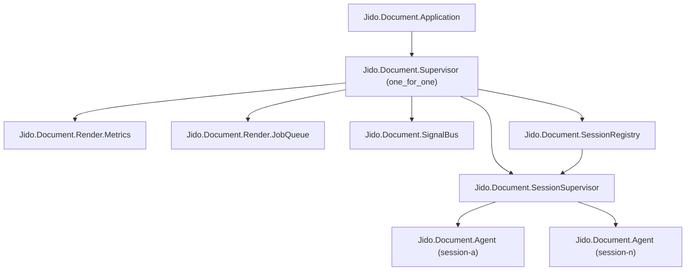

# 02 - Supervision and Runtime Topology

`Jido.Document.Application` defines a small supervision tree with clear
separation between shared runtime services and dynamic session processes.

## Topology

## Responsibilities by process

- `Render.Metrics`:
  - tracks render strategy and quality metrics.
- `Render.JobQueue`:
  - handles async render jobs.
- `SignalBus`:
  - session-scoped pub/sub fanout with queue-aware dropping.
- `SessionSupervisor`:
  - dynamic supervisor for session agents.
- `SessionRegistry`:
  - session discovery, path-indexing, lock ownership, idle cleanup.

## Startup behavior

Before supervisor start, `Application.start/2` runs render plugin startup
checks (`PluginManager.startup_check/2`) and logs compatibility diagnostics.

## Session lifecycle

1. `SessionRegistry.ensure_session/3` or `ensure_session_by_path/3` is called.
2. Registry starts a new `Agent` under `SessionSupervisor` if missing.
3. Registry monitors agent PID and removes stale entries on `:DOWN`.
4. Idle reclaim can terminate old sessions (`reclaim_idle/2`).

## Failure model

- `one_for_one` supervision isolates process crashes.
- Session failures do not inherently crash sibling sessions.
- Registry and signal bus are shared services and should remain lightweight.

