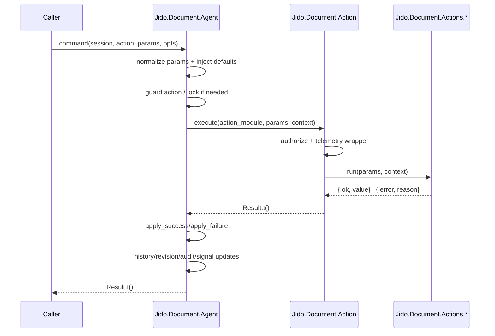

# 03 - Agent Command Pipeline

`Jido.Document.Agent` is the stateful orchestrator. It owns:

- active `Document`
- history model
- checkpoint and recovery state
- revision sequence
- preview/fallback state
- audit trail window

## Command execution flow

## Key contracts

- Action behavior (`Jido.Document.Action`):
  - `name/0`
  - `idempotency/0`
  - `run/2`
- Result envelope (`Jido.Document.Action.Result`):
  - `status`
  - `value` or `error`
  - metadata (`action`, `idempotency`, `correlation_id`, `duration_us`)
- Context envelope (`Jido.Document.Action.Context`):
  - session identity, actor, document snapshot, options

## Cross-cutting behaviors in pipeline

- Authorization:
  - applied in `Action.execute/3`
  - role matrix + optional custom hook policy
- Retry:
  - controlled by `Jido.Document.Reliability.with_retry/2`
  - retries only retryable errors
- Optimistic rollback:
  - failed mutation actions can revert to previous state
- Render fallback:
  - on render failure, agent emits a fallback preview payload

## Sync vs async

- Sync mode (`mode: :sync`):
  - `GenServer.call`, immediate `Result.t()`.
- Async mode (`mode: :async`):
  - `GenServer.cast`, returns `:ok`.

## History commands

`:undo` and `:redo` are handled via history transitions and require a loaded
document. They update revision/audit metadata similarly to regular actions.

