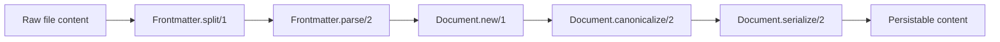

# 04 - Document Model and Frontmatter Engine

`Jido.Document.Document` is the canonical in-memory representation:

- `path`
- `frontmatter` map
- `body` string
- `raw` source content
- schema reference
- dirty/revision tracking

## Parse and serialize pipeline

## Frontmatter semantics

- Supported delimiters:
  - YAML: `---`
  - TOML: `+++`
- Frontmatter is optional:
  - no delimiter => `frontmatter: %{}`
- Serialization defaults:
  - empty frontmatter omitted unless `emit_empty_frontmatter: true`

## Mutation semantics

- `update_frontmatter/3`:
  - `:merge` (default) or `:replace`
- `update_body/3`:
  - body normalization policies (line endings, trailing whitespace)
- `apply_body_patch/3`:
  - full replace string
  - function patch
  - `%{search, replace, global}`

All effective mutations increment revision and set dirty state.

## Schema validation

`Jido.Document.Schema` validates frontmatter against `Field` declarations:

- required fields
- defaulting
- type coercion (`string`, `integer`, `float`, `boolean`, arrays, enums)
- unknown key policy (`:warn`, `:ignore`, `:reject`)

This layer validates metadata contracts without coupling to UI or transport.

