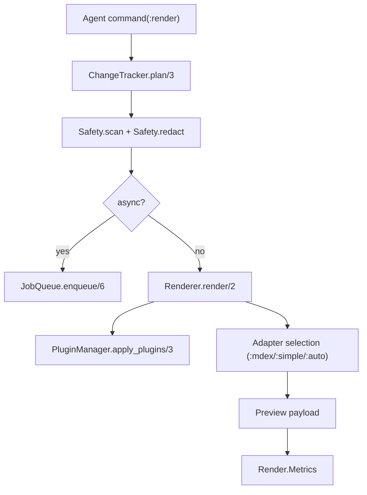

# 05 - Rendering and Preview Subsystem

Rendering is split between orchestration and transformation components:

- orchestration:
  - `Jido.Document.Actions.Render`
  - `Jido.Document.Render.ChangeTracker`
  - `Jido.Document.Render.JobQueue`
  - `Jido.Document.Render.Metrics`
- transformation:
  - `Jido.Document.Renderer`
  - `Jido.Document.Render.PluginManager`
  - `Jido.Document.Render.ThemeRegistry`

## Render flow

## Renderer design points

- Frontmatter stripping is default for preview.
- Adapter auto-fallback:
  - prefers `:mdex` when available
  - falls back to `:simple` with diagnostics
- Fallback preview exists for degraded render conditions.

## Plugin model

- Contract:
  - `c:Jido.Document.Render.Plugin.transform/2`
  - `c:Jido.Document.Render.Plugin.compatible?/1`
- Manager behavior:
  - ordered execution by priority
  - startup compatibility checks
  - failure isolation with diagnostics, not hard crash

## Output contract

Render output includes:

- `html`
- `toc`
- `diagnostics`
- `cache_key`
- `adapter`
- `metadata` (extensions, syntax highlight settings, plugin list, etc.)
