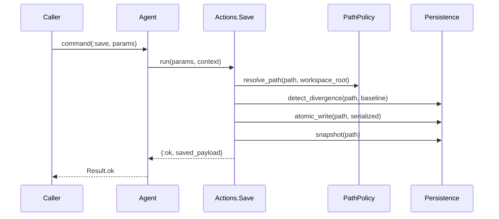

# 06 - Persistence, Divergence, and Recovery

This subsystem combines path policy, atomic writes, baseline snapshots, and
checkpoint-based crash recovery.

## Save pipeline

## Divergence protection

- Save compares current file state against baseline snapshot.
- On mismatch, conflict error is returned unless explicit strategy allows:
  - `:overwrite`
  - `:merge_hook`

## Atomic write strategy

`Persistence.atomic_write/3` performs:

1. write fsynced temp file
2. optional metadata preservation
3. atomic rename to target
4. best-effort directory sync

This minimizes partial-write corruption risk.

## Checkpoint and recovery model

`Jido.Document.Checkpoint` stores session payload snapshots to disk:

- schema version
- session id
- document struct
- disk snapshot baseline
- capture timestamp

Recovery APIs on `Agent`:

- `recovery_status/1`
- `recover/2`
- `discard_recovery/1`
- `list_recovery_candidates/1`

## Path security boundary

`Jido.Document.PathPolicy.resolve_path/2` enforces workspace-root containment to
prevent path escapes from session load/save operations.

