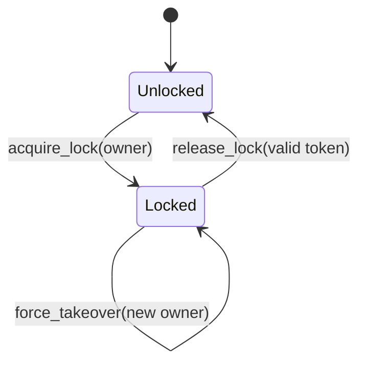
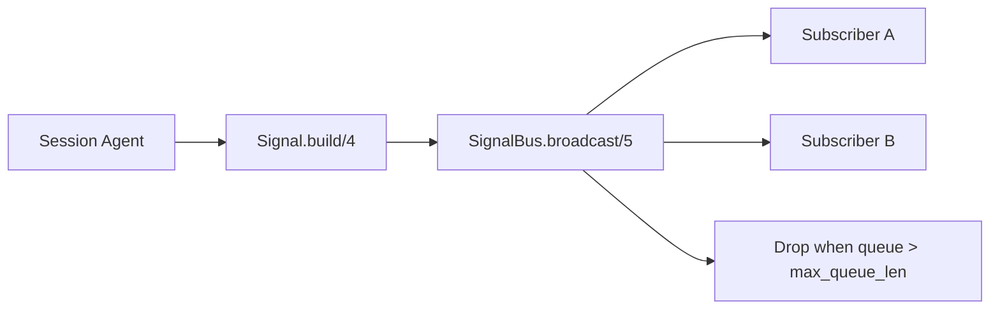

# 07 - Session Registry, Locking, and Signals

Multi-client coordination is handled by `SessionRegistry` and `SignalBus`.

## Session registry responsibilities

- deterministic file-based session id generation
- lazy session startup under `SessionSupervisor`
- path-to-session indexing
- idle-session reclaim
- optimistic lock ownership with revisioned tokens

## Lock lifecycle

## Lock semantics

- `acquire_lock/4`:
  - returns `lock_token`, `lock_revision`, owner
- `validate_lock/3`:
  - optimistic token check for write-authorized caller
- `release_lock/3`:
  - token-required release
- `force_takeover/4`:
  - operator override path with `previous_owner`

## Signal bus model

`Jido.Document.SignalBus` provides session-scoped fanout with queue-aware
dropping.

Design notes:

- Signals are versioned (`schema_version`) and type-checked.
- Payloads are size-bounded with truncation metadata.
- Monitoring cleans up dead subscriber PIDs automatically.

